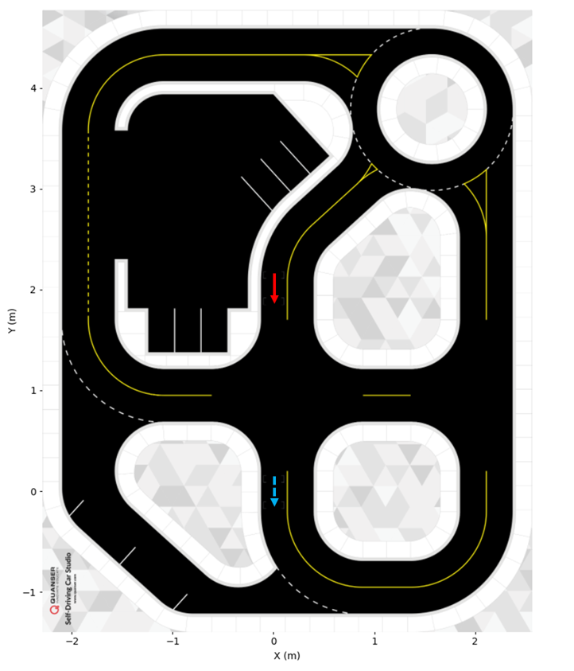
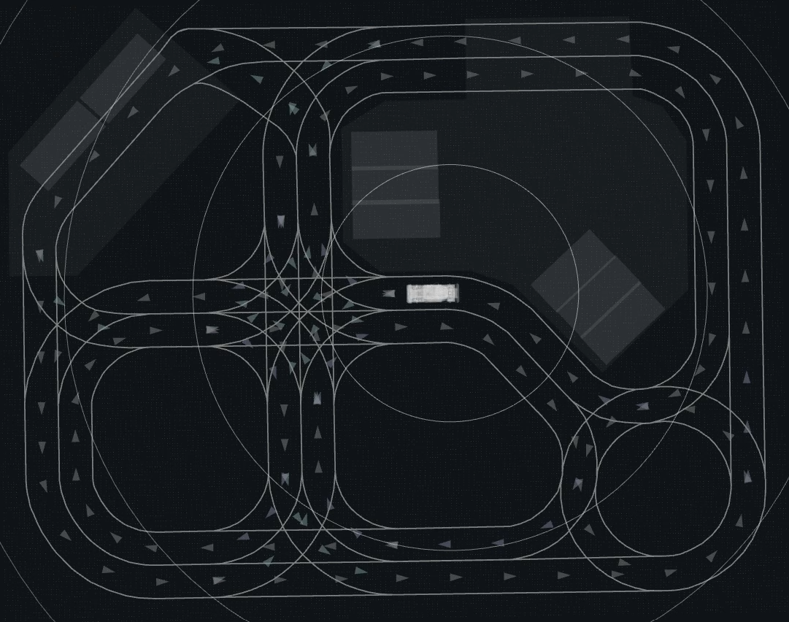
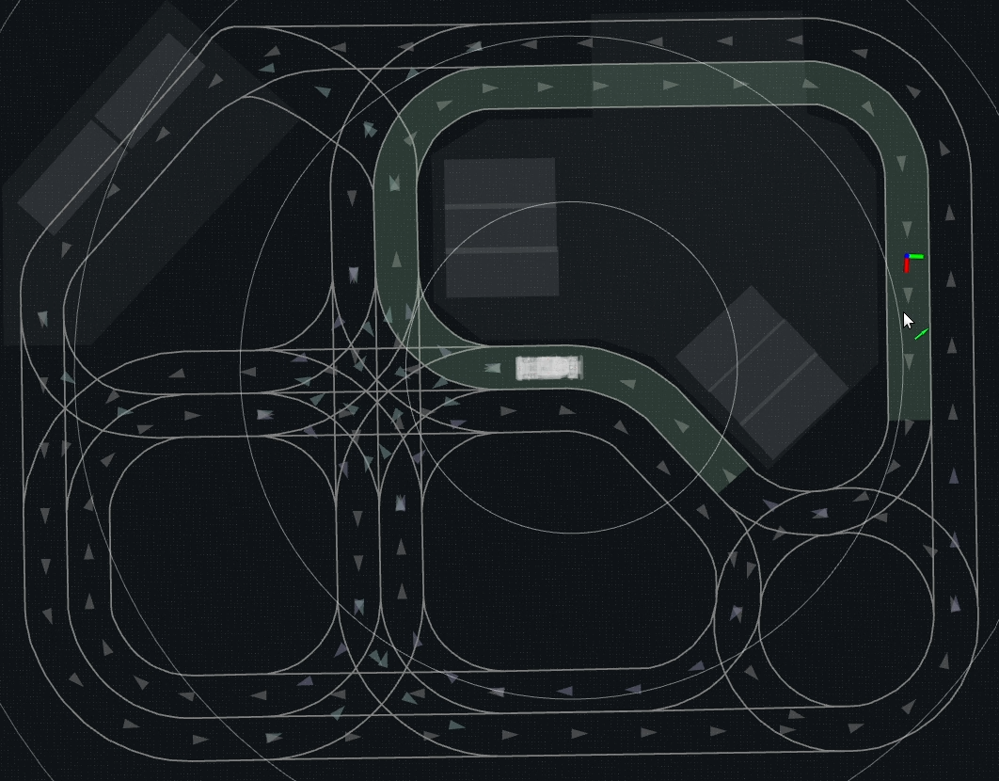
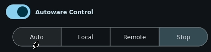

# Run the example
This guide describes how to run the QCar2 Autoware example using:

- Autoware stack running inside Docker
- Scan-matching and hardware nodes running directly on QCar2
---
### Map Information

This example uses a map created from Quanser Self-Driving Car Studio (SDCS) roadmap.   
The map files are located at `/workspace/src/external/qcar2/map/sdcs`.

A vehicle pose in the map is defined as [x, y, θ], where:
- x is the position along the X-axis  
- y is the position along the Y-axis  
- θ (theta) is the vehicle orientation  

The vehicle orientation θ is defined as rotation about the vertical axis. Positive rotation is counter-clockwise

The coordinate system used in the SDCS roadmap is illustrated in the figure below, with two example poses.

- [ 0.0 , 2.0 , -π/2 ] (solid arrow) 

- [ 0.0 , 0.0 , -π/2 ] (dashed arrow)

The wheel positions corresponding to [ 0.0 , 0.0 ] and [ 0.0 , 2.0 ] are also marked directly on the physical roadmap.  
These reference points are used to help align the vehicle during calibration.



---

### 1. Prepare the Vehicle

Before launching:

1. Place the QCar2 inside the SDCS roadmap.
2. Position the vehicle for pose [ 0.0 , 2.0 , -π/2 ] and align wheels with markings.
3. Connect to the QCar2 as per the [Connectivity Guide](https://github.com/quanser/Quanser_Academic_Resources/blob/dev-qcar/3_user_manuals/qcar2/user_manual_connectivity.pdf).   
It is recommended to connect to the QCar2 via Remote Desktop.

### 2. Running Hardware Nodes

The localization and hardware nodes are included in Quanser Academic Resources. Open a terminal and navigate to the QCar2 hardware workspace:

```bash
cd ~/Documents/Quanser/5_research/sdcs/qcar2/ros2
```
Setup workspace environment:
```bash
source /opt/ros/humble/setup.bash
source install/setup.bash
```
Launch the localization and hardware nodes:
If this is the **first run**, a reference scan must be created. 
Place the QCar2 in the calibration pose `[0.0, 2.0, -π/2]` marked on the roadmap and run the following:
```bash
ros2 launch qcar2_nodes qcar2_scan_match_launch.py calibrate:=true
```
This will capture a reference scan, save the reference scan and automatically begin localization.

To reuse the last saved reference scan, run the following command:
```bash
ros2 launch qcar2_nodes qcar2_scan_match_launch.py calibrate:=false
```
**NOTE:** if the wall boundary is changed, a re-calibration is required.

### 3. Launch Autoware in Docker

Open a second terminal and navigate to the Autoware workspace and enter the Docker container:
```bash
cd ~/Documents/autoware
./docker/run.sh --devel --no-nvidia
```
Inside Docker, navigate to the workspace and set up environment:
```bash
cd /workspace
source install/setup.bash
```
Launch the QCar2-Autoware example:
```bash
ros2 launch qcar2_launch qcar2_autoware.launch.xml map_path:=/workspace/src/universe/external/qcar2/map/sdcs launch_dummy_diag_publisher:=true init_x:=0.0 init_y:=2.0 init_th:=-1.57079633
```
The parameters `init_x`, `init_y`, and `init_th` correspond to the starting location of the QCar2 on the physical roadmap.

This launches autoware modules, QCar2 interface packages and RViz visualization.
Once all systems are running, the map and the vehicle should be visible in RViz, and the vehicle pose should match real-world QCar2.



### 4. Set a Valid Goal Pose

To move the vehicle, first click `2D Goal Pose` in the top banner of RViz and then move your mouse to the desired position. Hold down the mouse button, drag and release in the direction of your desired orientation to select a goal pose on the map.

For a goal pose to be valid, it should be near the center of a lane and be aligned with lane direction.
Invalid goals will produce no trajectory.

When a valid goal pose is selected, a route will be created and highlighted in the map.



### 5. Enable Autonomous Mode

After setting the goal, you can start the vehicle by clicking `Auto` in the control panel



The QCar2 will start driving shortly.

**IMPORTANT:** Always start the QCar2 hardware nodes before launching the Autoware packages.

To stop or close Autoware, follow these steps:

1. Click `Stop` in the control panel to stop the vehicle.
2. Stop the Autoware packages by pressing `Ctrl+C` in the terminal where they are running.
3. Exit the Docker container by typing `exit` in the terminal.
4. Stop the QCar2 hardware nodes by pressing `Ctrl+C` in the terminal where they are running.


